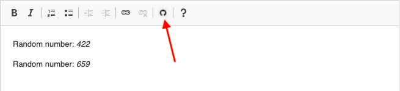

# Random Number

Random Number is a custom [CKEditor 4](https://ckeditor.com/ckeditor-4/) plugin that allows inserting a random number from 1 to 1000 into your text.  

Click the **Random Number** icon on the toolbar to generate a random number:  



### Installation

To start using the product, download any version of CKEditor 4. You can install a Basic Package via [this link]((https://download.cksource.com/CKEditor/CKEditor/CKEditor%204.14.1/ckeditor_4.14.1_basic.zip).

Random Number requires creating a new folder and configuring a **config.js** file to run.

1. Open CKEditor installation files, go to **plugins**, and create a **randomnumber** folder inside this directory manually or via Terminal. For example:

```sh
$ mkdir randomnumber
```

2. Download a **plugin.js** file, and place it inside a **randomnumber** folder. Your final file path should have the following structure:

```sh
./ckeditor/plugins/randomnumber/plugin.js
```

3. Configure a **config.js** file by pasting the following script inside a `config` function:

```javascript
config.extraPlugins = 'randomnumber';
```

4. If applicable, enable `extraPlugins` in your HTML output:

``` javascript
var editor = CKEDITOR.replace('your_textarea', {
                     extraPlugins: 'randomnumber'
                     });
```

### Development

You can modify the **Random Number** source code as per your needs. For example:

* This will generate numbers from 1 to 10:

```javascript
init: function( editor ) {
        editor.addCommand( 'insertRandom', {
            exec: function( editor ) {
                var random_number = Math.floor((Math.random() * 10) + 1);
                editor.insertHtml( 'Random number: <em>' + random_number + ' </em>' );
            }
        });
```

* This will get rid of unnecessary text:

```js
init: function( editor ) {
        editor.addCommand( 'insertRandom', {
            exec: function( editor ) {
                var random_number = Math.floor((Math.random() * 1000) + 1);
                editor.insertHtml( '<em>' + random_number + ' </em>' );
            }
        });
```

> **Note:** This plugin inserts content that is allowed in default installations. However, in case you want to introduce some more complex custom modifications, you might need to integrate the plugin with [Advanced Content Filter](https://ckeditor.com/docs/ckeditor4/latest/guide/dev_acf.html) (ACF). If you encounter any issues related to content incompatibility, try adding `config.allowedContent = true;` to a `config` function.